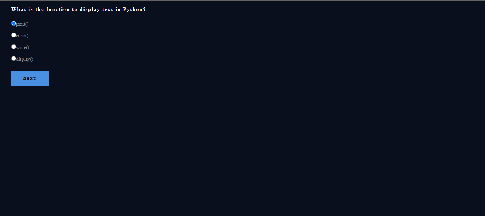
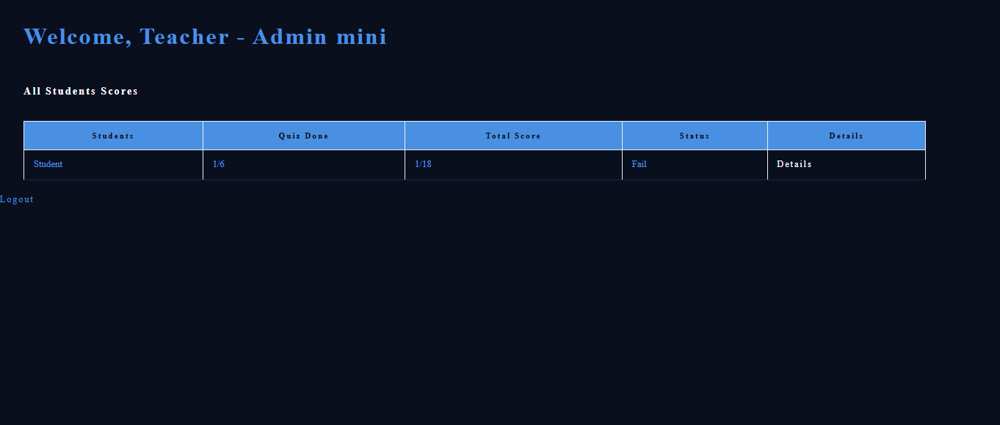
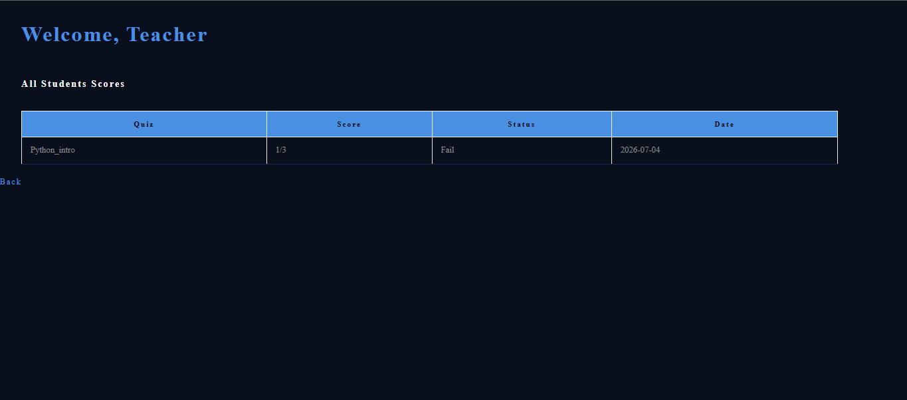
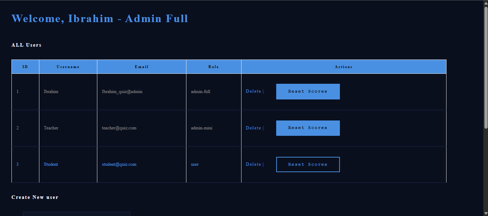
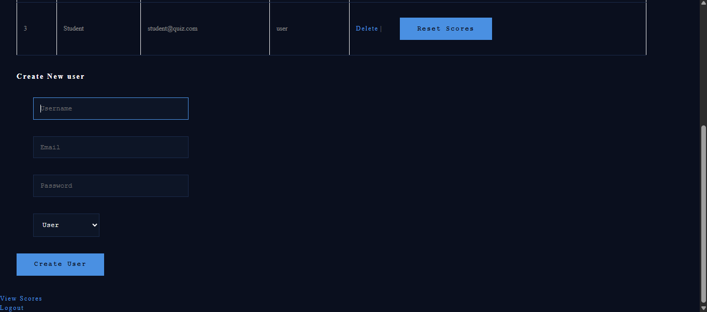

# Quiz Web App - Flask + SQLite

A role-based quiz web application built with Python and Flask.
Designed for classroom use: teachers manage students, students take quizzes.

## Features

- 3 role levels: Admin Full / Admin Mini / Student
- Students can take quizzes once (no retakes without admin reset)
- Answer choices are shuffled randomly each time
- Teachers (Admin Mini) view all student scores and pass/fail status
- Admin Full can create users, delete users, and reset scores
- 6 quizzes covering: Python, Pseudo-code, Flowcharts, SQL, HTML/CSS, Flask

## Screenshots

### Login Page

### Student Home - Quiz Selection

> Students see all available quizzes. Each quiz can only be taken once per student.

### Quiz Question Page

> Answer choices are shuffled randomly on each attempt to prevent memorization.

### Quiz Result Page

> Score is saved automatically to the SQLite database the moment the quiz ends.

### Admin Mini Panel - Teacher Score Overview

> Teachers see all student scores, quizzes completed, and pass/fail status in real time.

### Student Detail Results - Per Quiz Breakdown

> Drill-down view showing each quiz a student attempted, their score, and the date taken.

### Admin Full Panel - User Management

> Full admin can delete any user or reset their scores. All user data is stored in SQLite.

### Admin Full - Create New User Form

> Admin can create new users and assign their role: User, Admin Mini, or Admin Full.

## Tech Stack

- Python 3
- Flask (web framework + routing + sessions)
- SQLite (database)
- Jinja2 (HTML templating)
- CSS (custom dark theme)

## How to Run

1. Install Flask: pip install flask
2. Run the database setup: python Quiz_Create.py
3. Start the app: python app.py
4. Open your browser: http://localhost:5000

## Test Accounts

| Role       | Email                  | Password    |
|------------|------------------------|-------------|
| Admin Full | Ibrahim_quiz@admin     | admin123    |
| Admin Mini | teacher@quiz.com       | teacher123  |
| Student    | student@quiz.com       | student123  |

## Known Limitations

This is a school project. Known areas for improvement:
- Passwords are stored in plain text (should use hashing e.g. bcrypt)
- Some queries use f-strings instead of parameterized queries (SQL injection risk)
- No registration page (users created by admin only)
